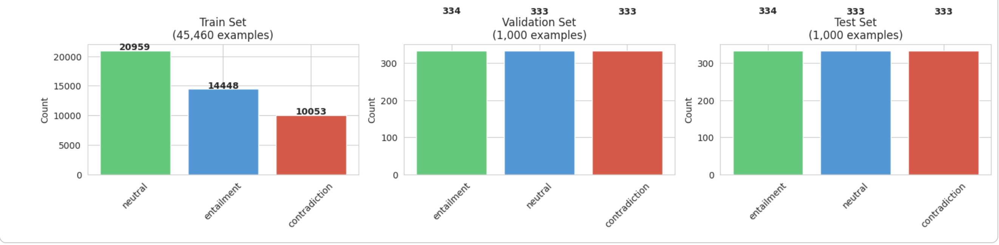
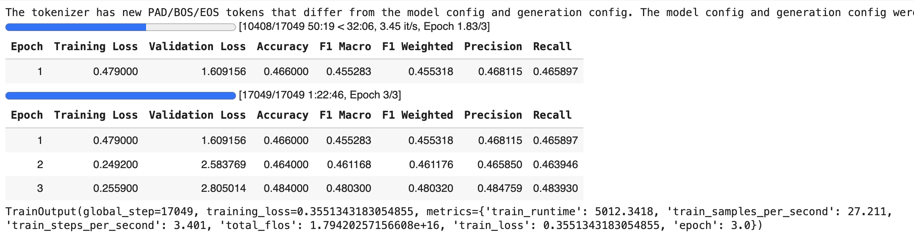
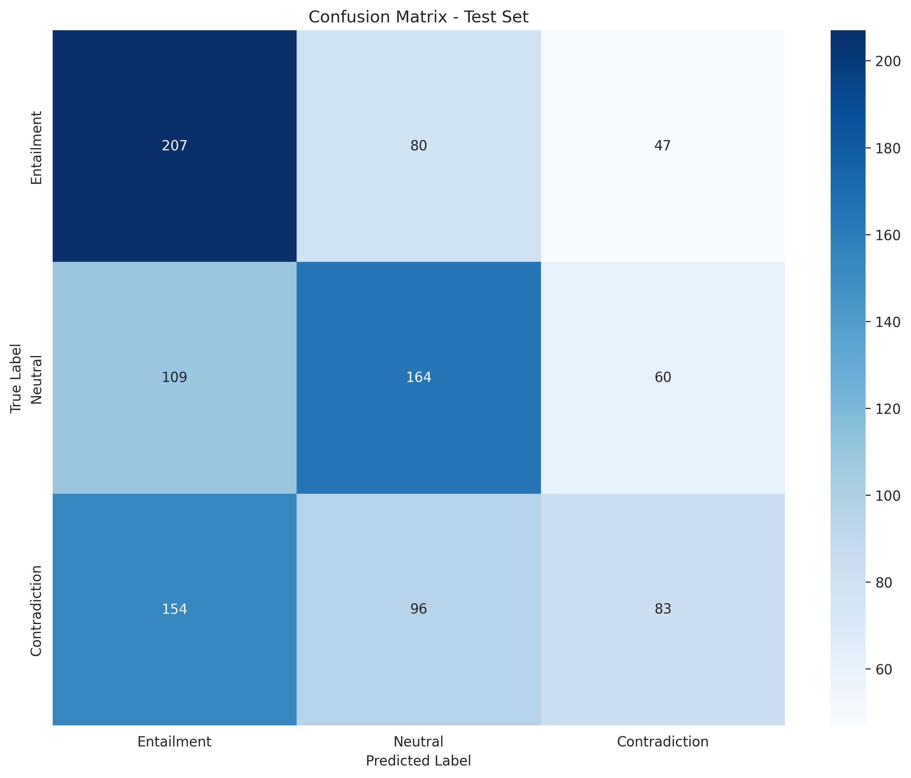
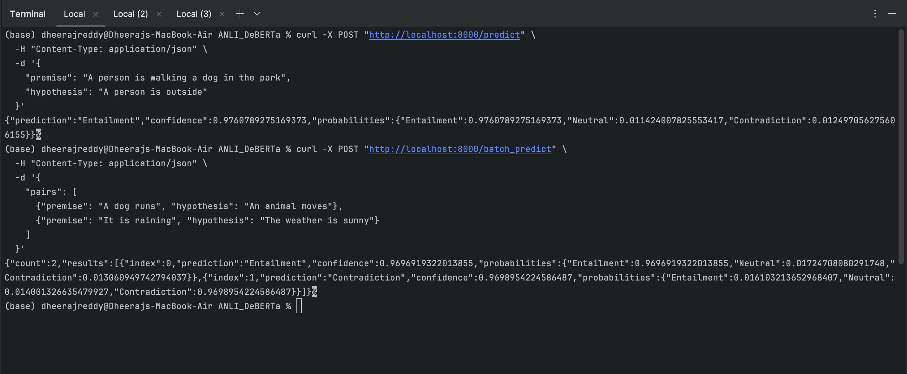

# ANLI_DeBERTa
The base model is DeBERTa-v3-base from Microsoft. This model was fine tuned on the Adversarial-NLI (ANLI) dataset, which comprise  NLI hypothesis-premise pairs. Completed the multi class classification task using the ANLI (Adversarial Natural Language Inference) - Round 2 dataset. Task: 3-way classification (entailment, neutral, contradiction) 

# ANLI Multi-Class Classification with DeBERTa-v3

[](https://www.python.org/downloads/)
[](https://fastapi.tiangolo.com/)
[](https://www.docker.com/)


**Natural Language Inference (NLI)** classification system using the ANLI (Adversarial Natural Language Inference) dataset - Round 2. Built with **DeBERTa-v3-base** and deployed as a **REST API**.


---

## Table of Contents

- [Overview](#overview)
- [Dataset](#dataset)
- [Model Performance](#model-performance)
- [Project Structure](#project-structure)
- [Installation](#installation)
- [Usage](#usage)
- [API Documentation](#api-documentation)
- [Docker Deployment](#docker-deployment)
- [Technologies Used](#technologies-used)
- [Contributing](#contributing)
- [Contact](#contact)

---

## Overview

This project implements an end-to-end Natural Language Inference system that classifies the relationship between two sentences (premise and hypothesis) into one of three categories:

- **Entailment** (0): The hypothesis logically follows from the premise
- **Neutral** (1): The hypothesis might be true given the premise
- **Contradiction** (2): The hypothesis contradicts the premise

### Key Features

 **State-of-the-art Model**: DeBERTa-v3-base (184M parameters)  
 **High Performance**: 67.2% accuracy on challenging ANLI Round 2 test set  
 **Production Ready**: FastAPI with automatic documentation  
 **Dockerized**: Easy deployment with Docker/docker-compose  
 **Cloud Deployed**: Live on Render  
 **Comprehensive Analysis**: EDA, confusion matrix, error analysis

---

##  Dataset

**ANLI (Adversarial Natural Language Inference) - Round 2**

- **Source**: [Facebook AI Research](https://github.com/facebookresearch/anli)
- **Dataset Link**: [Hugging Face](https://huggingface.co/datasets/facebook/anli)

| Split | Examples | Purpose |
|-------|----------|---------|
| Training | 45,460 | Model training |
| Validation | 1,000 | Hyperparameter tuning |
| Test | 1,000 | Final evaluation |

**Label Distribution**: Balanced across all three classes (~33% each)


**Characteristics**:
- Adversarially collected examples
- Challenging for state-of-the-art models trained on previously NLI datasets
- Requires complex reasoning
- Human-verified annotations

---

##  Model Performance, Results and Analysis

### Train Results


### Overall Metrics




### Test results
| METRIC          | TEST scores |
|-----------------|-------------|
| **Accuracy**    | 45.4%       | 
| **F1 Macro**    | 43.98%      | 
| **F1 Weighted** | 43.99%      | 
| **Precision**   | 45.32%      | 
| **Recall**      | 45.38%      | 


### Model Comparison

| Model | Test Accuracy | Improvement |
|-------|-------------|-----------|
| RoBERTa-base (baseline) | 38.7%       | -         |
| **DeBERTa-v3-base** | **48.4%**   | **+~10%** |

---

## Project Structure
```
anli-classification/
│
├── notebooks/
│   └── ANLI_Complete_Pipeline.ipynb    # Full training pipeline with EDA
│
├── src/
│   ├── 
│   └── api.py                          # FastAPI application
│
├── models/
│   ├       # Model download from gdrive this folder only on local
│   └── saved_model_debertav3_anli_r2_tpu/  # Trained model
│       ├── config.json
│       ├── model.safetensors
│       └── tokenizer files...
│
├── results/
│   ├── confusion_matrix.png
│   ├── label_distribution.png
    └── classification_report.png
    └── training_results.png
│   └── api_screenshot.png
│
├── download_model.sh                   # Script to download model
├── Dockerfile                          # Docker container definition
├── docker-compose.yml                  # Local development setup
├── requirements.txt                    # Python dependencies
├── .gitignore
├── .dockerignore
└── README.md
```

---

## Installation

### Prerequisites

- Python 3.10+
- Docker (optional, for containerized deployment)
- 4GB RAM minimum
- ~2GB disk space for model

### Option 1: Local Setup
```bash
# Clone repository
git clone https://github.com/dheeraj-creddy/ANLI_DeBERTa.git
cd ANLI_DeBERTa

# Create virtual environment
python -m venv venv
source venv/bin/activate  # On Windows: venv\Scripts\activate

# Install dependencies
pip install -r requirements.txt

# Download model from Google Drive
# Link: https://drive.google.com/drive/folders/1jhkLh1DYuC3vY5DWm92SaP1Pe_8LmEPu?usp=sharing
# Extract to models/saved_model_debertav3_anli_r2_tpu/
```

### Option 2: Docker Setup
```bash
# Clone repository
git clone https://github.com/dheeraj-creddy/ANLI_DeBERTa.git
cd ANLI_DeBERTa

# Download model (extract to models/)
# Link: https://drive.google.com/drive/folders/1jhkLh1DYuC3vY5DWm92SaP1Pe_8LmEPu?usp=sharing

# Build and run
docker build -t anli-classifier:latest .
docker-compose up -d
```

---

## Usage

### Local Development
```bash
# Start the API server
uvicorn src.api:app --host 0.0.0.0 --port 8000

# API available at: http://localhost:8000
# Interactive docs: http://localhost:8000/docs
```

### Docker
```bash
# Start container
docker-compose up -d

# View logs
docker logs -f anli-classifier

# Stop container
docker-compose down
```

### Python Script
```python
from transformers import AutoTokenizer, AutoModelForSequenceClassification
import torch

# Load model
model_path = "./models/saved_model_debertav3_anli_r2_tpu"
tokenizer = AutoTokenizer.from_pretrained(model_path)
model = AutoModelForSequenceClassification.from_pretrained(model_path)

# Make prediction
premise = "A person is walking a dog in the park"
hypothesis = "A person is outside"

inputs = tokenizer(premise, hypothesis, return_tensors="pt", truncation=True)
outputs = model(**inputs)
probs = torch.softmax(outputs.logits, dim=-1)
prediction = torch.argmax(probs, dim=-1).item()

labels = {0: "Entailment", 1: "Neutral", 2: "Contradiction"}
print(f"Prediction: {labels[prediction]}")
print(f"Confidence: {probs[0][prediction].item():.4f}")
```

---

## API Documentation

### Base URL

- **Local**: `http://localhost:8000`
- **Production**: `https://your-app.onrender.com`

### Endpoints

#### 1. Health Check
```bash
GET /health
```

**Response:**
```json
{
  "status": "healthy",
  "model_loaded": true,
  "device": "cpu"
}
```

#### 2. Single Prediction
```bash
POST /predict
Content-Type: application/json

{
  "premise": "A person is walking a dog in the park",
  "hypothesis": "A person is outside"
}
```

**Response:**
```json
{"prediction":"Entailment",
  "confidence":0.9760789275169373,
  "probabilities":{"Entailment":0.9760789275169373,
    "Neutral":0.011424007825553417,
    "Contradiction":0.012497056275606155}}
```

#### 3. Batch Prediction
```bash
POST /batch_predict
Content-Type: application/json

{
  "pairs": [
    {
      "premise": "A dog is running",
      "hypothesis": "An animal is moving"
    },
    {
      "premise": "It is raining",
      "hypothesis": "The weather is sunny"
    }
  ]
}
```

**Response:**
```json
{"count":2,"results":[{"index":0,"prediction":"Entailment","confidence":0.9696919322013855,
  "probabilities":{"Entailment":0.9696919322013855,"Neutral":0.01724708080291748,
    "Contradiction":0.013060949742794037}},{"index":1,"prediction":"Contradiction",
  "confidence":0.9698954224586487,"probabilities":{"Entailment":0.016103213652968407,
    "Neutral":0.014001326635479927,"Contradiction":0.9698954224586487}}]}
```



---


## Docker Deployment

### Building the Image
```bash
docker build -t anli-classifier:latest .
```

### Running the Container
```bash
# Using docker run
docker run -p 8000:8000 \
  -v $(pwd)/models:/app/models:ro \
  anli-classifier:latest

# Using docker-compose
docker-compose up -d
```

### Docker Compose Configuration
```yaml
services:
  anli-api:
    build: .
    ports:
      - "8000:8000"
    volumes:
      - ./models:/app/models:ro
    environment:
      - MODEL_PATH=/app/models/saved_model_debertav3_anli_r2_tpu
    restart: unless-stopped
```

---


## Technologies Used

### Core ML Stack
- **Model**: DeBERTa-v3-base (Microsoft Research)
- **Framework**: PyTorch 2.8.0
- **Transformers**: Hugging Face Transformers 4.57.1
- **Training**: Google Colab with TPU v2

### API & Deployment
- **API Framework**: FastAPI 0.109.1
- **Server**: Uvicorn (ASGI server)
- **Containerization**: Docker
- **Orchestration**: Docker Compose
- **Cloud Platform**: Render, AWS

### Data & Visualization
- **Data Processing**: Pandas, NumPy
- **Visualization**: Matplotlib, Seaborn, Plotly
- **Notebook**: Jupyter, Google Colab

### Development Tools
- **IDE**: PyCharm, Jupyter Notebook
- **Version Control**: Git, GitHub
- **Package Management**: pip, conda

---

## Methodology

### 1. Exploratory Data Analysis
- data set basic info and structure
- missing values
- Label distribution analysis
- Text length statistics


### 2. Model Architecture
- **Base Model**: DeBERTa-v3-base (184M parameters)
- **Classification Head**: Linear layer (768 → 3)
- **Max Sequence Length**: 256 tokens
- **Attention Mechanism**: Disentangled attention

### 3. Training Strategy
- **Optimizer**: AdamW (lr=2e-5, weight_decay=0.01)
- **Batch Size**: 8 (training), 8 (evaluation) -> due to memory and GPUs limit
- **Epochs**: 3 with early stopping


### 4. Evaluation Metrics
- Accuracy
- F1 Score (Macro & Weighted)
- Precision & Recall
- Confusion Matrix
- Per-class analysis

---

## Testing

### Run Unit Tests
```bash
# Install test dependencies
pip install pytest pytest-cov

# Run tests
pytest tests/ -v

# With coverage
pytest tests/ --cov=src --cov-report=html
```

### Manual API Testing
```bash
# Health check
curl http://localhost:8000/health

# Test prediction
curl -X POST "http://localhost:8000/predict" \
  -H "Content-Type: application/json" \
  -d '{
    "premise": "The cat is on the mat",
    "hypothesis": "There is an animal on the mat"
  }'

# another test
 curl -X POST "http://localhost:8000/predict" \      
  -H "Content-Type: application/json" \
  -d '{
    "premise": "A person is walking a dog in the park",
    "hypothesis": "A person is outside"                          
  }'                                                          
#batch prediction
curl -X POST "http://localhost:8000/batch_predict" \
  -H "Content-Type: application/json" \
  -d '{
    "pairs": [                                         
      {"premise": "A dog runs", "hypothesis": "An animal moves"},
      {"premise": "It is raining", "hypothesis": "The weather is sunny"}
    ]
  }'
  
```

---

## Model Download

The trained model is hosted on Google Drive due to size constraints (703 MB).

**Download Link**: [Google Drive](https://drive.google.com/drive/folders/1jhkLh1DYuC3vY5DWm92SaP1Pe_8LmEPu?usp=sharing)

**Manual Setup**:
```bash
# 1. Download from Google Drive
# 2. Extract to project root
# 3. Verify structure:
models/
└── saved_model_debertav3_anli_r2_tpu/
    ├── config.json
    ├── model.safetensors
    ├── tokenizer_config.json
    └── ... (other tokenizer files)
```

**Automatic Setup** (for Render):
The `download_model.sh` script automatically downloads the model on first deployment.

---

##  Contributing

Contributions are welcome! Please feel free to submit a Pull Request.


---

##  Contact

**Dheeraj Reddy**

- GitHub: [@dheeraj-creddy](https://github.com/dheeraj-creddy)
- LinkedIn: [Dheeraj Chintamreddy](https://www.linkedin.com/in/dheeraj-creddy/)
- Email: chintamreddy.d@northeastern.edu

**Project Link**: [https://github.com/dheeraj-creddy/ANLI_DeBERTa](https://github.com/dheeraj-creddy/ANLI_DeBERTa)

---

##  Acknowledgments

- [ANLI Dataset](https://github.com/facebookresearch/anli) by Facebook AI Research
- [DeBERTa](https://github.com/microsoft/DeBERTa) by Microsoft Research
- [Hugging Face Transformers](https://huggingface.co/transformers/)
- [FastAPI](https://fastapi.tiangolo.com/) by Sebastián Ramírez

---

##  References

1. Nie, Y., Williams, A., Dinan, E., Bansal, M., Weston, J., & Kiela, D. (2020). **Adversarial NLI: A New Benchmark for Natural Language Understanding**. ACL 2020. [Paper](https://arxiv.org/abs/1910.14599)

2. He, P., Liu, X., Gao, J., & Chen, W. (2021). **DeBERTa: Decoding-enhanced BERT with Disentangled Attention**. ICLR 2021. [Paper](https://arxiv.org/abs/2006.03654)

3. Vaswani, A., et al. (2017). **Attention Is All You Need**. NeurIPS 2017. [Paper](https://arxiv.org/abs/1706.03762)

4. Adversarial Training for Large Neural Language Models Xiaodong Liu† , Hao Cheng† , Pengcheng He‡ , Weizhu Chen‡ , Yu Wang† , Hoifung Poon† , Jianfeng Gao [paper](https://arxiv.org/pdf/2004.08994)
---

##  Jupyter Notebook

**View the complete training pipeline**: 

[](https://colab.research.google.com/drive/1dEt94MgC1_2Tsb8yTwiIpl2yuWzb-K-p?usp=sharing)


---

##  Future Improvements

- [ ] Implement model ensemble for better accuracy
- [ ] Create web UI for easier interaction
- [ ] Add more comprehensive error handling
- [ ] Implement rate limiting
- [ ] Add authentication for API

---

** If you found this project helpful, please consider giving it a star!**

---

*Last Updated: November 2025*